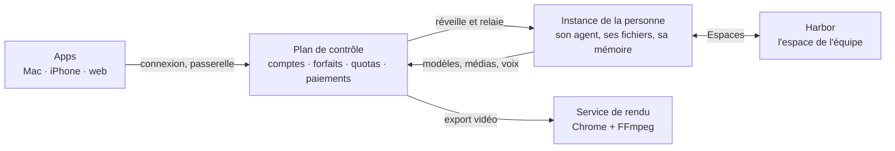

<h1 align="center">Baarali</h1>
<p align="center"><b>Un assistant IA qui travaille pour vous : il écrit, cherche, crée des images, des vidéos et des animations, et fait vos tâches, sur Mac, sur iPhone et sur le web.</b></p>

<p align="center">
  <a href="https://baarali.com">baarali.com</a> · <a href="https://app.baarali.com">app.baarali.com</a>
</p>

Baarali est pensé d'abord pour l'Afrique de l'Ouest, et ouvert au monde : l'app parle français, ses prix sont en francs CFA comme en euros, ses forfaits sont pensés pour le mobile money, et elle marche sur un téléphone modeste. Chaque personne a son propre agent, sur une machine à elle dans le cloud, avec sa mémoire, ses fichiers et ses outils. Rien à installer ni à configurer : on se connecte, on demande.

---

## Ce que Baarali sait faire

| | |
|---|---|
| **Discuter et travailler** | Un agent qui écrit, résume, cherche sur le web, lit vos fichiers, prépare vos réunions et rédige vos e-mails. Il choisit les bons outils lui-même. |
| **Images** | Affiches, visuels, logos, illustrations, à partir d'une phrase. |
| **Vidéos, voix et musique** | Plans filmés, voix off, musiques et jingles, par les meilleurs modèles du moment, au prix annoncé avant de lancer. |
| **Studio Motion** | Motion design aux couleurs de votre marque : annonce animée, logo animé, chiffres clés, sous-titres, compte à rebours, en 9:16, 1:1 ou 16:9. L'export en MP4, MP4 léger (WhatsApp), GIF ou WebM transparent se fait en une minute environ. |
| **Tâches planifiées** | Des agents qui travaillent seuls, chaque matin ou à chaque e-mail reçu. |
| **Espaces** | Le lieu de l'équipe : messages, fichiers partagés, tableaux blancs. Chacun y appelle son propre agent, qui répond avec son contexte à lui. |
| **Apps** | Des petits outils de travail construits dans Baarali, qui ont accès à tout l'agent. |

### Les forfaits

| Forfait | Prix | Minutes d'export Studio Motion |
|---|---|---|
| Découverte | gratuit | 2 par mois |
| Semaine | 5 € par semaine | 3 par semaine payée |
| Essentiel | 20 € par mois | 30 par mois |
| Pro | 100 € par mois | 120 par mois |
| Pro max | 200 € par mois | 300 par mois |

Les prix en francs CFA suivent la parité fixe (1 € = 655,957 FCFA). Le texte se décompte sur deux fenêtres, 5 heures et la semaine, au coût réel des modèles. Images, vidéos, voix, musiques et exports au-delà des minutes incluses se paient en **crédits médias**, vendus en packs de 2 €, 5 € et 20 €. Un export vidéo au-delà des minutes coûte 3 crédits la minute, comptés à la seconde. Une création qui échoue est toujours remboursée.

---

## Comment c'est construit



- **Le plan de contrôle** tient les comptes, les forfaits, les quotas et les crédits, et ne laisse jamais passer une clé de fournisseur vers l'instance. Il sert aussi baarali.com et la console d'administration.
- **Une instance par personne**, une micro-VM qui s'endort quand on ne l'utilise pas et se réveille à la première demande. Elle passe seule à chaque nouvelle version : à son réveil, ou après 10 minutes sans activité de son agent.
- **Le service de rendu** transforme une animation Studio Motion en vidéo. Il n'a pas d'adresse publique, et un pare-feu interdit au navigateur qui rend les pages de joindre le réseau interne.
- **Harbor** sert les Espaces.

Tout tourne chez [Fly.io](https://fly.io), à Paris.

Les documents de conception, à lire dans l'ordre, sont dans [`docs/baarali/`](docs/baarali/README.md). L'architecture cible, qui décrit chaque fonction telle qu'elle est en production, est dans [`TARGET_AGENTIC_ARCHITECTURE.md`](docs/baarali/TARGET_AGENTIC_ARCHITECTURE.md).

---

## Ce qu'il y a dans ce dépôt

| Dossier | Contenu |
|---|---|
| [`apps/baarali/packages/control`](apps/baarali/packages/control) | Le plan de contrôle : comptes, passerelle, forfaits, quotas, crédits médias, paiements, Studio Motion, console d'admin, baarali.com. |
| [`apps/baarali/packages/instance`](apps/baarali/packages/instance) | L'image de l'instance d'une personne : le serveur de l'agent, les compétences et serveurs MCP de Baarali (médias, Studio Motion). |
| [`apps/baarali/packages/render`](apps/baarali/packages/render) | Le service de rendu des vidéos Studio Motion. |
| [`apps/baarali/packages/desktop`](apps/baarali/packages/desktop) | La fabrication de l'app Mac : la marque Baarali et la traduction française, appliquées au build. |
| [`apps/baarali/packages/spaces`](apps/baarali/packages/spaces) | Le déploiement de Harbor pour Baarali. |
| [`apps/x`](apps/x) | L'app de bureau (Electron), le serveur de l'agent, et l'app mobile (Expo). |
| [`apps/harbor`](apps/harbor) | Harbor, le serveur des Espaces, et son protocole. |
| [`docs/baarali`](docs/baarali) | Les documents de conception de Baarali. |

### Travailler sur le code

Les trois espaces de travail se construisent dans cet ordre : Harbor, puis l'app (qui le lie), puis Baarali (qui lie `@x/shared`).

```sh
cd apps/harbor && pnpm install && pnpm -r build
cd ../x && pnpm install && (cd packages/shared && npm run build) && npm test
cd ../baarali && pnpm install && pnpm typecheck && pnpm test
```

Les règles du dépôt sont dans [`AGENTS.md`](AGENTS.md).

---

## D'où vient Baarali

Baarali est dérivé de [Rowboat](https://github.com/rowboatlabs/rowboat), sous licence [Apache 2.0](LICENSE) (voir [`NOTICE`](NOTICE)). On suit son évolution de près. La manière de rester à jour est décrite dans [`UPSTREAM.md`](docs/baarali/UPSTREAM.md), et chaque fichier d'origine que Baarali modifie est listé, avec la raison, dans [`DIVERGENCES.md`](docs/baarali/DIVERGENCES.md).

<p align="center">© 2026 OpenBaara</p>
